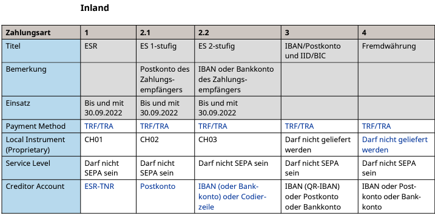
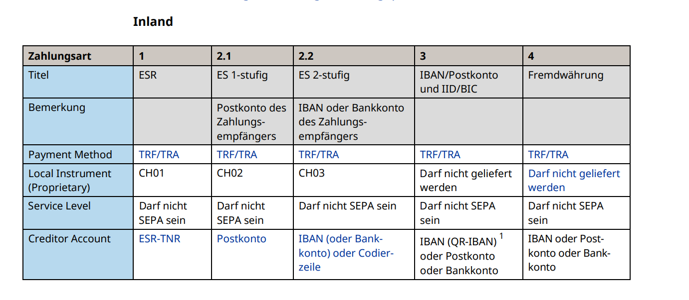

The iso20022-generator is a c# library which helps you generating iso 20022 artifacts with the minimum amount of information you need to set up valid documents.

What you can do at the moment:
- Currently the creation of pain.001 files is the only thing the library can do.
- The file can contain multiple transactions to different receivers.
- You can add multiple payment information records with multiple transactions each. Each with its different execution date.
- Swiss QR with reference number (QRR). Use IBANandQRR transaction type and set QRReferenceNumber property.

Limitations:
- Although the iso20022 is a standard definition it looks as there are a lot of excess to this standard in the world. The library was mainly built for communication with swiss banks. To be precise the library was successfully tested against the test environments from the following banks: Raiffeisen Bank Schweiz, Credit Suisse, UBS and Zürcher Kantonalbank

Usage:
have a look into the happy test file

# Schemas and Examples
## Kunde-Bank-Meldungen

https://www.six-group.com/de/products-services/banking-services/standardization/iso-payments.html

# Swiss Payment Standards 2021
## Schweizer Business Rules für Zahlungen und Cash Management für Kunde-Bank-Meldungen
Version 2.10, gültig per 19. November 2021

https://www.six-group.com/dam/download/banking-services/interbank-clearing/de/standardization/iso/swiss-recommendations/archives/business-rules/business-rules.pdf

# Swiss Payment Standards 2021

## Schweizer Implementation Guidelines für Kunde-Bank-Meldungen für Überweisungen im Zahlungsverkehr

### Customer Credit Transfer Initiation (pain.001)

Version 1.11, gültig per 19. November 2021

https://www.six-group.com/dam/download/banking-services/interbank-clearing/de/standardization/iso/swiss-recommendations/archives/implementation-guidelines-ct/implementation-guidelines-ct.pdf

# Swiss Payment Standards 2021 
## Swiss Implementation Guidelines for Customer-Bank Messages Credit Transfer (Payment Transactions)

### Customer Credit Transfer Initiation (pain.001)

Version 1.11, with effect from 19 November 2021 
https://www.six-group.com/dam/download/banking-services/interbank-clearing/en/standardization/iso/swiss-recommendations/implementation-guidelines-ct.pdf

# ISO 20022 Payments

## Schweizer Implementation Guidelines für Kunde-Bank-Meldungen für SEPA-Lastschriften

### Customer Direct Debit Initiation (pain.008)

https://www.six-group.com/dam/download/banking-services/interbank-clearing/de/standardization/iso/swiss-recommendations/archives/implementation-guidelines-sdd/implementation-guidelines-sdd_v2_5_1.pdf

# Payment Types

# Zahlungsarten

## Implemented and tested

|  Description | Type  | Implementation  | Local Instrument |
|:---|:---|:---|:---|
| ESR - orange with reference number -> !!!!obsolete!!!!| 1  | TransactionESR  | CH01 |
| ES - red no reference number -> !!!!obsolete!!!!| 2.1  | TransactionES  | CH02 |
| IBAN/QRR  | 3  |  TransactionIBANandQRR | |
| IBAN/SCOR  | 3  |  TransactionIBANandSCOR | |

# Version Information
## 3.0.5 (2024-03-14)
- changed minimum length of IBAN to 15 (Norway)
- updated several NuGet packages

## 3.0.4 (2023-07-18)
- added UnstructuredRemittanceInformation and AdditionalRemittanceInformation to TransactionIBANandSCOR

# Version Information
## 3.0.3 (2023-05-08)
- added boolean value batchBookingSpezified to enable export of pmtInf.BtchBookg flag properly

# Version Information
## 3.0.2 (2023-04-13)
- Split Street and StreetNumber into two properties
- Don't export postal adress properties if empty
- Don't export InstructionForDebtorAgent if empty

## 3.0.1 (2023-04-03)
- Corrected issue with unintentionally overriding of sender information

## 3.0.0 (2023-03-30) - Breaking Changes
- Separated Sender information from Initialzation
- Changed Sender information to public property
- Added README.md for nuget package and moved help documentation to this file

## 2.1.1 (2023-03-24)
Corrected null pointer exception on missing additional remittance information

## 2.1.0 (2022-11-22)
 Added possibility to change contact detail and contact detail other values (Index 1.8)
- Added configuration for payment method (TFA, TRA, CHK, ....) (Index 2.2)
- Removed field PaymentType -> obsolete
- Added additional remittance information field for QRR transaction
- Added unstructured remittance information for IBAN
- Removed ESR and ES transactions -> obsolete
- Added configuration for control sum field (Index 1.7)
- Added AutoCalculateControlSum field

## 2.0.0 (2022-10-12)
- Added InstructionForDebtorAgent  Index 2.85
- Updated help

## 1.6.1 (2022-10-15)
- Added IBAN and SCOR transaction. Allow empty address and receiver name
- Bump NuGet.CommandLine from 4.9.5 to 4.9.6 

## 1.6.0 (2022-10-15)
- Added QR with Reference

## 1.4.0 (2022-10-14)
- Extended generator to add more than one payment info record including the feature to use a different required execution date per payment info

## 1.4.0 (2022-10-12)
- Implementation of ESR and ES 1, introduced transactions for each implementation
- FIX: Implemenetation of required BIC Code for PostFinance support

## 1.3.0 (2021-12-02)
- Fixed issue with amount in payment file

## 1.1.0 (2021-11-02)
- Fixed issue with setting property Street-Number (StrtNm, 2.79)

## 1.0.0 (2021-10-15)
- Initial release

# Links

- [License](LICENSE.md)
- [Homepage enio AG](https://www.enio.ch)
- [Releases](https://github.com/enioag/iso20022-generator/releases)
